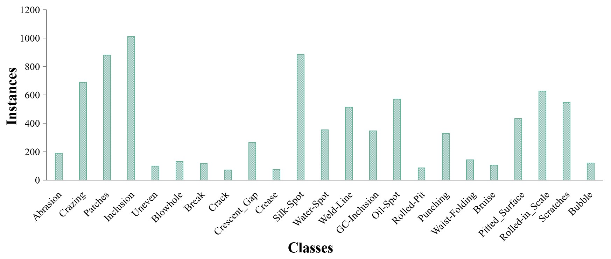

# DEFECT-YOLO: Enhanced Metal Surface Defect Detection

## Overview
DEFECT-YOLO is an advanced model designed to enhance the detection of metal surface defects by addressing challenges such as inter-class similarity and intra-class variance. Based on the YOLOv8s model, DEFECT-YOLO introduces several key enhancements to improve accuracy and efficiency in multi-metal defect detection.

## Innovations
- **Effective Multi-scale Downsampling Convolution Module (EMDCM):** Enhances detection accuracy while keeping parameters minimal.
- **Atrous Spatial Pyramid Pooling with Efficient Multiscale Attention (ASPPE):** Improves the model's capability to capture local features.
- **Multi-branch Coordinate Attention (MCA):** Strengthens feature extraction for more precise defect detection.
- **Normalized Wasserstein Distance (NWD) Loss Function:** Integrates localization and Complete Intersection over Union (CIoU) losses to better detect small target defects.

## Performance
- **Mean Average Precision (mAP@0.5):** Achieves a 3.6% improvement over baseline models.
- **Parameter Increase:** Only 1.64M additional parameters.
- **Inference Speed:** Meets real-time detection requirements for industrial applications.

## Environment Setup
- **Operating System:** Ubuntu 18.04
- **CPU:** Intel(R) Core(TM) i9-10900X CPU @ 3.70GHz
- **GPU:** NVIDIA RTX 3090Ti with 24GB memory
- **Programming Language:** Python 3.8.16
- **IDE:** VSCode
- **Deep Learning Framework:** PyTorch 2.0.0
- **GPU Support:** CUDA 11.7
- **Virtual Environment:** Anaconda 4.13.0
- **Framework Version:** Ultralytics 8.0.114

## Training Parameters
- **Epochs:** 300
- **Batch Size:** 32
- **Initial Learning Rate:** 1e-2
- **Momentum:** 0.937
- **Weight Decay:** 1e-4
- **Number of Threads:** 12
- **Optimizer:** SGD

## Getting Started

### Prepare Dataset

#### Dataset Source
The DEFECT dataset is curated from the following sources:
- **Aluminum Defect Dataset**
- **Magnetic Tile Surface Defects Dataset**
- **GC-DET Dataset**
- **NEU-DET Dataset**

The dataset includes common defect categories, with corrections made by field experts to address incorrect labels, remove poor-quality samples, and annotate previously unlabelled data.

#### Dataset Distribution
The distribution of defect categories in the DEFECT dataset is illustrated below:



#### Detailed Distribution
| Defect Type         | Quantity |
|---------------------|----------|
| Abrasion            | 188      |
| Crazing             | 689      |
| Patches             | 881      |
| Inclusion           | 1011     |
| Uneven              | 99       |
| Blowhole            | 129      |
| Break               | 117      |
| Crack               | 70       |
| Crescent_Gap        | 265      |
| Crease              | 74       |
| Silk-Spot           | 884      |
| Water-Spot          | 354      |
| Weld-Line           | 513      |
| GC-Inclusion        | 347      |
| Oil-Spot            | 569      |
| Rolled-Pit          | 85       |
| Punching            | 329      |
| Waist-Folding       | 143      |
| Bruise              | 106      |
| Pitted_Surface      | 432      |
| Rolled-in_Scale     | 628      |
| Scratches           | 548      |
| Bubble              | 119      |

**Split the DEFECT Data:**
Divide the DEFECT dataset into training, validation, and test sets with a ratio of 8:1:1
| Split   | Total | Train | Val  | Test |
|---------|:-----:|:-----:|:----:|:----:|
| Number  | 5748  | 3834  | 427  | 474  |

#### Distribution Analysis
To investigate the distribution of the center point coordinates of the instance box and the width and height distribution of the instance box in the DEFECT-DET dataset, corresponding charts were generated:

- **Center Point Coordinates Distribution:**
  - The area above and near the center on the x-axis had darker colors, indicating that labels were predominantly located at the center of the images. Other labels were scattered in various positions.


- **Width and Height Distribution of the Instance Box:**
  - The distribution is mainly concentrated in the bottom-left corner, suggesting that most defects in this dataset are small targets. As the aspect ratio of labels increased, the number of defects gradually decreased, indicating a lower prevalence of large-sized targets. Some labels were concentrated near the end of the coordinate axes, indicating the existence of extremely wide and tall labels.


#### Installation
To install DEFECT-YOLO, clone the repository and install the necessary dependencies:

```bash
git clone https://github.com/Dafei-Zhang/DEFECT-YOLO.git
cd DEFECT-YOLO
pip install -r requirements.txt
```

## References

1. Tianchi Platform (2023). Aluminum Defect Dataset. [Tianchi](https://tianchi.aliyun.com) (accessed August 2, 2023).
2. Huang, Y. B., Qiu, C. Y., Guo, Y., Wang, X. N., & Yuan, K. (2018). Surface Defect Saliency of Magnetic Tile. In **2018 IEEE 14th International Conference on Automation Science and Engineering (CASE)**, Munich, Germany, pp. 612-617. [DOI: 10.1109/COASE.2018.8560423](https://doi.org/10.1109/COASE.2018.8560423)
3. Lv, X. M., Duan, F. J., Jiang, J. J., Fu, X., & Gan, L. (2020). Deep Metallic Surface Defect Detection: The New Benchmark and Detection Network. In **Sensors**, 20(6), 1562. [DOI: 10.3390/s20061562](https://doi.org/10.3390/s20061562)
4. Song, K. C., & Yan, Y. H. (2013). A Noise Robust Method Based on Completed Local Binary Patterns for Hot-Rolled Steel Strip Surface Defects. In **Applied Surface Science**, 285(21), 858–864. [DOI: 10.1016/j.apsusc.2013.09.002](https://doi.org/10.1016/j.apsusc.2013.09.002)
